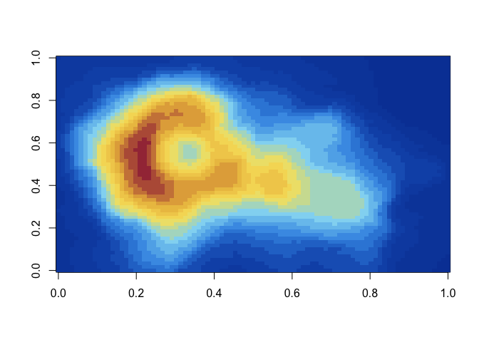

<!-- README.md is generated from README.Rmd. Please edit that file -->

# DreamTheatR

<!-- badges: start -->
<!-- badges: end -->

R color palettes inspired by Dream Theater album artwork.

## Installation

You can install the development version from
[GitHub](https://github.com/) with:

``` r
# install.packages("devtools")
devtools::install_github("Brent-Rodgers/DreamTheatR")
```

## Usage

``` r
library(DreamTheatR)

# See all palettes
names(dt_palettes)
#> [1] "DramaticTurn1"   "Falling1"        "Images1"         "SixDegrees1"    
#> [5] "ViewFromTheTop1"
```

## Palettes

### Images and Words (1992)

``` r
dt_palette("Images1")
```

<!-- -->

### Falling Into Infinity (1997)

``` r
dt_palette("Falling1")
```

<!-- -->

### Six Degrees of Inner Turbulence (2002)

``` r
dt_palette("SixDegrees1")
```

<!-- -->

### A Dramatic Turn of Events (2011)

``` r
dt_palette("DramaticTurn1")
```

<!-- -->

``` r
pal <- dt_palette("DramaticTurn1", 21, type = "continuous")
image(volcano, col = pal)
```

<!-- -->

### A View from the Top of the World (2021)

``` r
dt_palette("ViewFromTheTop1")
```

<!-- -->

## Other Stuff

-   Heavily inspired by [Karthik Ram’s `wesanderson`
    package](https://github.com/karthik/wesanderson) and [@ewenme’s
    `ghibli` package](https://github.com/ewenme/ghibli)
